# Blue Team Village Teleport cluster

## What is this repo?
This repo contains a Terraform module and an Ansible role that can be imported into existing projects to setup a Teleport cluster and agents.

## Prerequisites
### Install/Setup Terraform
It should be noted that this repo only supports Terraform `v1.3.7` and greater.

* [Terraform install on Windows](https://learn.hashicorp.com/tutorials/terraform/install-cli)
* [Terraform install on Linux ](https://learn.hashicorp.com/tutorials/terraform/install-cli)
* [Terraform install on macOS](https://learn.hashicorp.com/tutorials/terraform/install-cli)

### Install/Setup Anislbe
It should be noted that this repo only supports Ansible `v2.14.1` and greater.

* [Ansible install on Windows](https://docs.ansible.com/ansible/latest/installation_guide/installation_distros.html#installing-ansible-on-windows)
* [Ansible install on Linux ](https://docs.ansible.com/ansible/latest/installation_guide/installation_distros.html#installing-ansible-on-ubuntu)
* [Ansible install on macOS](https://docs.ansible.com/ansible/latest/installation_guide/installation_distros.html#installing-ansible-on-ubuntu)

### Install/Setup AWS CLI and Terraform
* [AWS CLI Windows install](https://docs.aws.amazon.com/cli/latest/userguide/install-cliv2-windows.html)
* [AWS CLI Linux install](https://docs.aws.amazon.com/cli/latest/userguide/install-cliv2-linux.html)
* [AWS CLI macOS install](https://docs.aws.amazon.com/cli/latest/userguide/install-cliv2-mac.html)

### Install/Setup Teleport tsh
* [Teleport tsh install on Windows](https://goteleport.com/docs/installation/#windows-tsh-client-only)
* [Teleport tsh install on Linux ](https://goteleport.com/docs/installation/#linux)
* [Teleport tsh install on macOS](https://goteleport.com/docs/installation/#macos)

## Github SSO
This section will walk through the process to create a Github Oauth app for Teleport SSO. These steps need to be executed by a Github org admin.

1. Log into Github as an org admin
1. Browse to your Github orgs settings page
    * [BlueTeamVillage settings page](https://github.com/organizations/blueteamvillage/settings/profile)
1. Developer settings > OAuth apps
1. Select "Register an application"
    1. Enter an application name
    1. Enter your project's Homepage URL
    1. Enter a description
    1. Enter `https://<teleport FQDN>/v1/webapi/github/` for Authorization callback URL
        1. 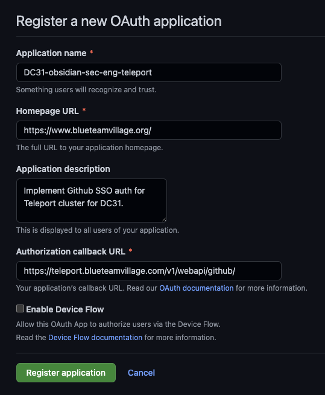
    1. Select "Register application"
        1. 
1. Select "Generate a new client secret"
1. Copy "OAuth client ID" and "Oauth client secret"

## Terraform
Perform the following instructions in an existing Terraform project. Upon completion, this Terraform module will create all the necessary AWS resources for a high-availability Teleport cluster:

- Teleport all-in-one (auth, node, proxy) single cluster ec2 instance
- DynamoDB tables (cluster state, cluster events, ssl lock)
- S3 bucket (session recording storage)
- Route53 `A` record
- Security Groups and IAM roles

### Terraform layout

File           | Description
-------------- | ---------------------------------------------------------------------------------------------
dynamodb.tf    | DynamoDB table provisioning. Tables used for Teleport state and events.
ec2.tf         | EC2 instance provisioning.
iam.tf         | IAM role provisioning. Permits ec2 instance to talk to AWS resources (S3, DynamoDB, etc)
outputs.tf     | Export module variables to be used by other Terraform resources
route53.tf     | Route53 zone creation. Requires a hosted zone to configure SSL.
s3.tf          | S3 bucket provisioning. Bucket used for session recording storage.
secrets.tf     | Creates empty secret stub for Github Oauth client secret
variables.tf   | Inbound variables for Teleport module

### Instructions
1. `vim main.tf` and add:
```
module "teleport" {
  source = "github.com/blueteamvillage/btv-teleport-single-cluster"

  #### General ####
  PROJECT_PREFIX = <project name>
  primary_region = <region to deploy Teleport cluster too>
  public_key_name = <Name of an SSH key to provision the EC2 instance>

  #### Route53 ####
  route53_zone_id = "<Route 53 Zone ID for the Teleport FQDN>"
  route53_domain = "<domain>"

  #### VPC ####
  vpc_id = <VPC ID to deploy Teleport too>
  teleport_subnet_id = <Subnet ID to deploy Teleport too>

}
```
1. `terraform init`
    1. Import this new module
1. `terraform apply`
```
module.teleport.aws_dynamodb_table.teleport_locks: Creating...
module.teleport.aws_dynamodb_table.teleport: Creating...
module.teleport.aws_dynamodb_table.teleport_events: Creating...
module.teleport.aws_s3_bucket.teleport: Creating...
module.teleport.aws_s3_bucket.teleport: Creation complete after 2s [id=defcon-2023-obsidian-teleport-kxl6y]
module.teleport.aws_s3_bucket_acl.teleport: Creating...
```

### Set the value of Github OAuth secret
1. Log into AWS console
1. Go to the [Secrets Manager service](https://us-east-2.console.aws.amazon.com/secretsmanager/home?region=us-east-2#)
1. Terraform created an empty with the following name schema: `"${var.PROJECT_PREFIX}-teleport-github-OAuth-secret"`
1. Secret value > Retrieve secret value
    1. This will produce an error because no value has been set, this is expected
1. Select "Set secret value"
1. Set secret value to the Github OAuth client secret

## Ansible
Perform the following instructions in an existing Ansible project. Upon completion, this Ansible will create a single-node Teleport "cluster" configured with Github SSO.

### Terraform layout

File                             | Description
----------------------------------------- | ----------------------------------------------------------------
teleport-cluster/tasks/init_linux.yml     | Ansible tasks to update linux and set basic OS settings
teleport-cluster/tasks/setup_teleport.yml | Ansible tasks to install Teleport and configure based on the tempalte in `teleport-cluster/templates`
teleport-cluster/templates/cap.yaml.j2                   | Configure Github SSO as the default login mechanism
teleport-cluster/templates/github.yaml.j2                | Configure Github SSO for your org
teleport-cluster/templates/sec_infra_role.yaml.j2        | Define the resources admins have access too
teleport-cluster/templates/workshop_contributors.yaml.j2 | Define the resources workshop contributors have access too
teleport-cluster/var/main.yml | Variables for how to install and configure Teleport

### Create a tunnel using SSM
Teleport by default does not expose SSH to the public internet. To provision the EC2 instance via Ansible we can use SSM to create a tunnel that can be used by Ansible.

1. `aws ssm start-session --target <Teleport EC2 instance ID> --document-name AWS-StartPortForwardingSession --parameters '{"portNumber":["22"], "localPortNumber":["2022"]}'`


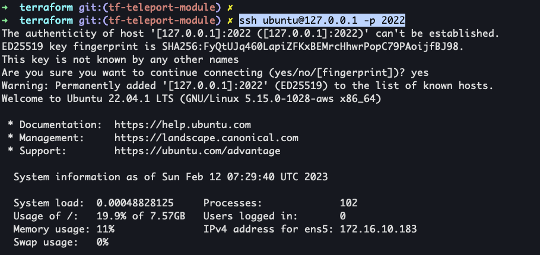

### Init Ansible playbook
1. `ansible-galaxy collection install amazon.aws`
1. `pip3 install -U boto3==1.26.69`
1. `vim hosts.ini` and set:
```ini
[teleport_cluster]
127.0.0.1 ansible_port=2022 ansible_user=ubuntu
```

1. `group_vars/teleport_cluster.yml` and set:
    1. General
        1. `teleport_fqdn` - Set the fully qualified domain for Teleport
        1. `primary_region` - Set to the region where you want to host Teleport
    1. AWS
        1. `teleport_bucket_name` - Set this to the name of the S3 bucket created by the Terraform for Teleport
        1. `teleport_dynamodb_table` - Set this to the name of the DynamoDB table  created by the Terraform for Teleport
            1. Name schmea: `"${var.PROJECT_PREFIX}-teleport-${random_string.suffix.result}"`
            1. [AWS DynamoDB Table view](https://us-east-2.console.aws.amazon.com/dynamodbv2/home?region=us-east-2#tables)
        1. `teleport_dynamodb_events_table` - Set this to the name of the DynamoDB table  created by the Terraform for Teleport
            1. Name schmea: `"${var.PROJECT_PREFIX}-teleport-${random_string.suffix.result}-events"`
            1. [AWS DynamoDB Table view](https://us-east-2.console.aws.amazon.com/dynamodbv2/home?region=us-east-2#tables)
    1. Github
        1. `github_org_name` - Name of the Github org for SSO
        1. `github_client_id` - The Github Oauth client ID  - NOT a secret
        1. `github_client_secret` - Define the name of the AWS Secret that contains the Github Oauth client` secret.
        1. `github_redirect_url` - Leave this as the default value unless you are hosting Teleport at a different URL path.
        1. `github_admin_team` - Define the Github team that contains a list of users that will be admins for the Teleport cluster
        1. `github_workshop_contributors` - Define the Github team that contains a list of users that will be accessing computing resources behind the Teleport cluster
    1. 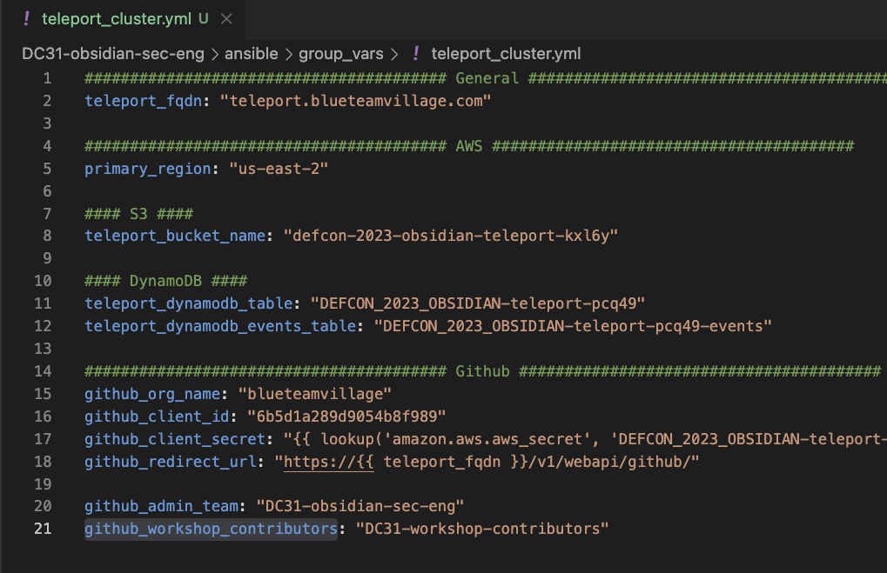
    1. Save and exit

### Run Ansible playbook
1. `ansible-playbook -i hosts.ini deploy_teleport_cluster.yml`
    1. 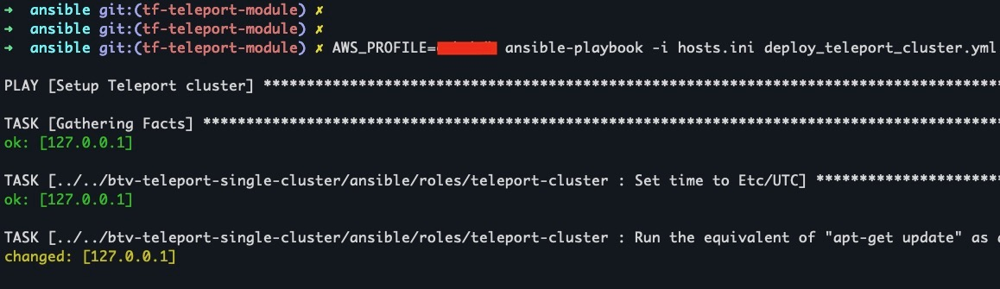

## Teleport
1. Connect to Teleport using SSM: `aws ssm start-session --target <Teleport EC2 instance ID>`
1. `/bin/bash`
    1. 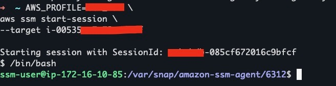
1. `tctl users add admin --roles=editor,access --logins=root,ubuntu`
    1. Copy the URL produced
    1. 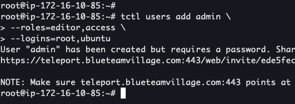
1. Enter the URL produced in the previous command into your browser
1. Select "Get started"
    1. 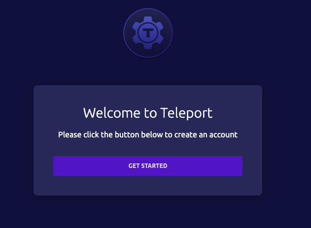
1. Enter a password for the admin user
    1. 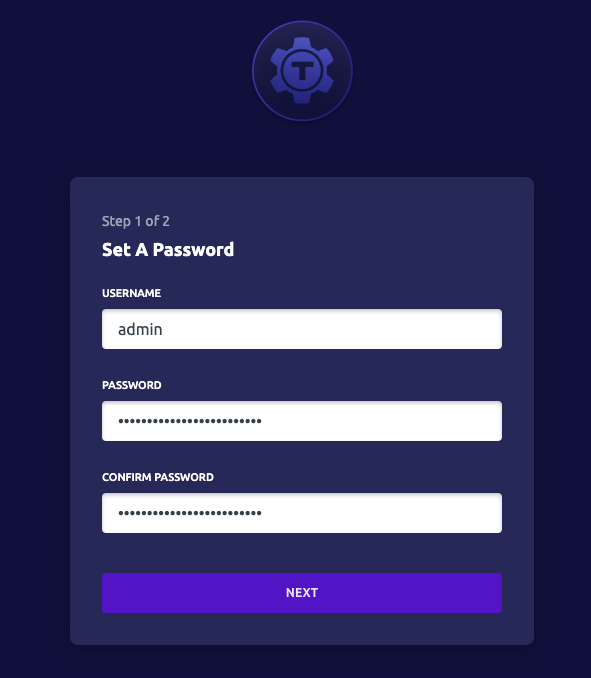
1. Select "Next"
1. Setup OTP
    1. 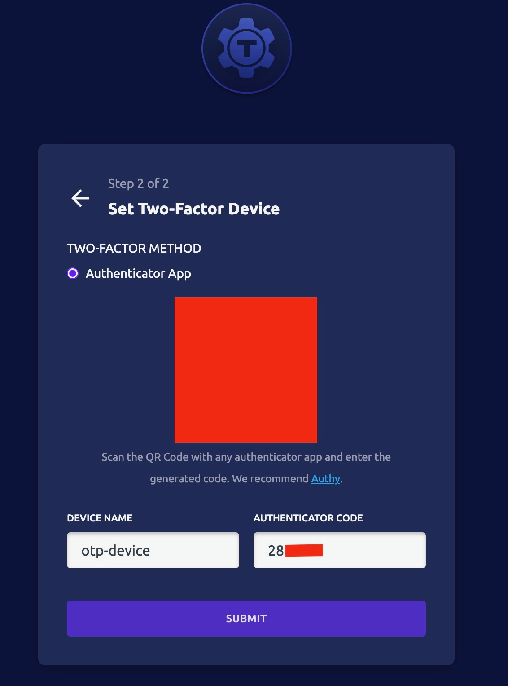
1. Select "Go to dashboard"
    1. 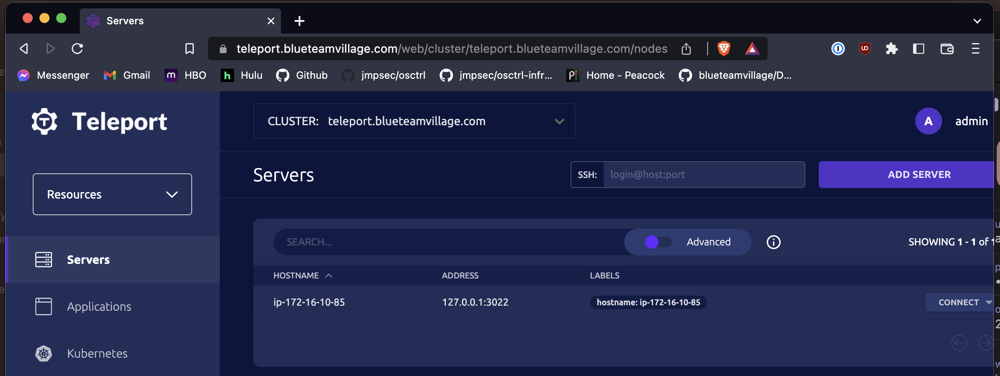

## User login via Github SSO
### Log into Teleport via browser
1. Browese to Teleport FQDN
    1. Ex: `https://teleport.blueteamvillage.com/web/login`
1. Select "Github"
1. Select "Authorize <Github org name>
    1. 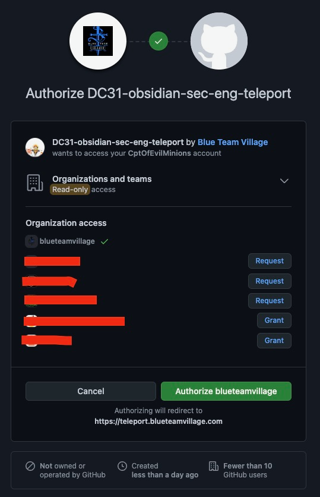

### Log into Teleport using tsh CLI
1. `tsh login --proxy=<teleport FQDN>`
    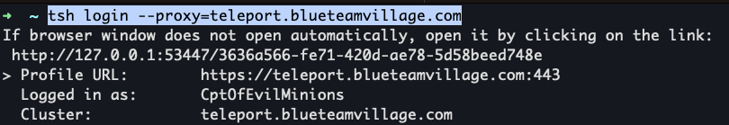

## Supported versions
* `Terraform v1.3.7`
* `Ansible v2.14.1`
* `Ubuntu Server 22.04`
* `Teleport v12`
* `awscli v2.2.31`

## References
* [Teleport starter cluster](https://github.com/gravitational/teleport/blob/master/examples/aws/terraform/starter-cluster/)
* [Module Sources](https://developer.hashicorp.com/terraform/language/modules/sources)
* [Installing Ansible on specific operating systems](https://docs.ansible.com/ansible/latest/installation_guide/installation_distros.html#installing-ansible-on-ubuntu)
* [DC31-obsidian-sec-eng/terraform/README.md](https://github.com/blueteamvillage/DC31-obsidian-sec-eng/blob/main/terraform/README.md)
* [aws_security_group](https://registry.terraform.io/providers/hashicorp/aws/latest/docs/resources/security_group)
* [Teleport - Networking](https://goteleport.com/docs/reference/networking/)
* [aws_security_group_rule](https://registry.terraform.io/providers/hashicorp/aws/latest/docs/resources/security_group_rule)
* [aws_eip](https://registry.terraform.io/providers/hashicorp/aws/latest/docs/resources/eip)
* [lower](https://developer.hashicorp.com/terraform/language/functions/lower)
* [aws_iam_policy_document](https://registry.terraform.io/providers/hashicorp/aws/latest/docs/data-sources/iam_policy_document)
* [replace](https://developer.hashicorp.com/terraform/language/functions/replace)
* [aws_s3_bucket_lifecycle_configuration](https://registry.terraform.io/providers/hashicorp/aws/latest/docs/resources/s3_bucket_lifecycle_configuration)
* [teleport/examples/aws/terraform/starter-cluster/cluster.tf](https://github.com/gravitational/teleport/blob/master/examples/aws/terraform/starter-cluster/cluster.tf)
* [Set up Single Sign-On with GitHub](https://goteleport.com/docs/access-controls/sso/github-sso/)
* [Teleport TSH installation](https://goteleport.com/docs/installation/#windows-tsh-client-only)
* [Teleport Storage backends](https://goteleport.com/docs/reference/backends/#dynamodb)
* [Convert value of an Ansible variable from lower case to upper case](https://serverfault.com/questions/677683/convert-value-of-an-ansible-variable-from-lower-case-to-upper-case)
* [Boto3 Docs 1.26.69 documentation](https://boto3.amazonaws.com/v1/documentation/api/latest/guide/quickstart.html)
* [Teleport Configuration Reference](https://goteleport.com/docs/reference/config/)
* []()
* []()
* []()
* []()
* []()
